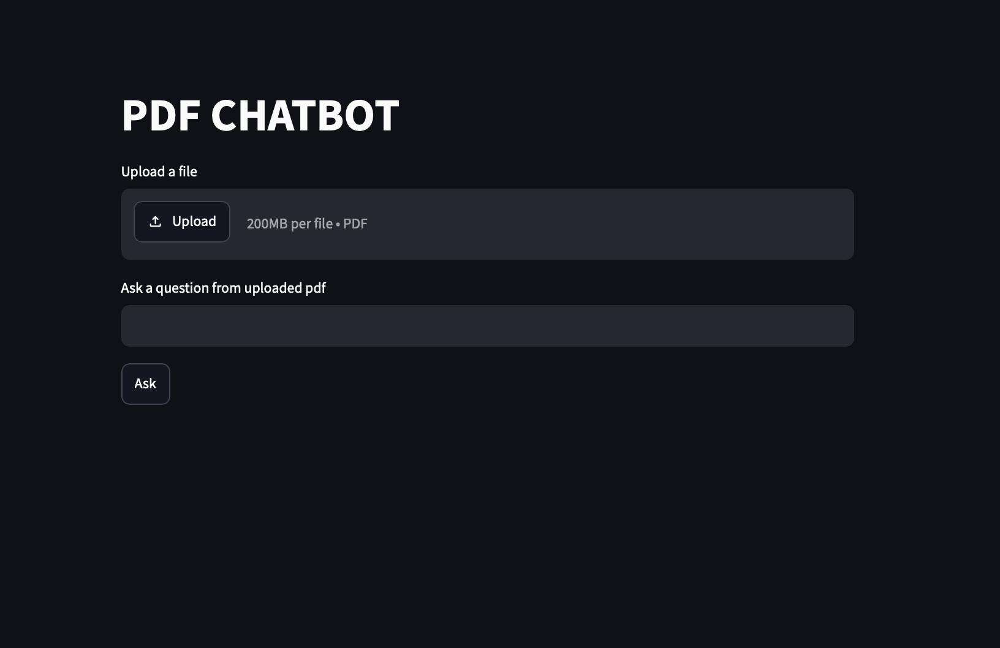
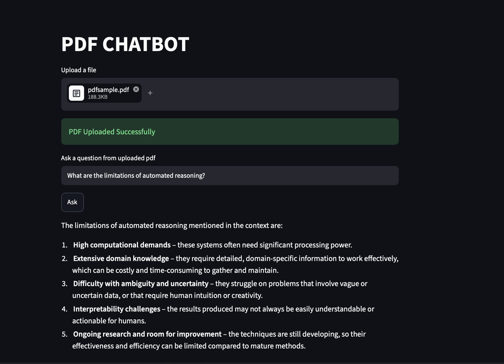

# PDF RAG Chatbot

An AI-powered PDF Question Answering application built using FastAPI, Streamlit, LangChain, FAISS, and Groq LLM.

Users can upload PDF files and ask questions based on the document content using Retrieval-Augmented Generation (RAG).

## Features

* PDF Upload
* Semantic Search using FAISS
* AI-powered Question Answering
* FastAPI Backend
* Streamlit Frontend

## Tech Stack

* FastAPI
* Streamlit
* LangChain
* FAISS
* HuggingFace Embeddings
* Groq API

## Run Backend

cd backend
uvicorn app.main:app --reload

## Run Frontend

cd frontend
streamlit run app.py

## API Endpoints

* `POST /upload-file`
* `POST /ask`

## DEMO 

